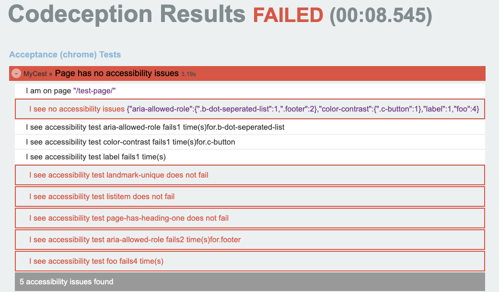

# AxeCeption – axe-core accessibility testing for Codeception

A lightweight Codeception module + reporter to run axe-core in your browser tests and generate a consolidated HTML report (Twig-based) per test suite.

- Module: runs axe-core in the current page via WebDriver, supports axe.configure and custom axe script URL.
- Reporter: aggregates results from all tests and renders tests/_output/axeception-report.html using Twig templates.

## Features
- Execute axe.run() in real browser context (Codeception WebDriver)
- Optional axe.configure(...) via YAML config (passed verbatim to axe)
- Per-violation details (rule, impact, WCAG tags, nodes with target selectors and HTML snippets)
- One consolidated HTML report with Table of Contents (anchors per test)
- Custom output filename per test (via module config reportFilename)

## Requirements
- PHP 8.3+
- Codeception 5+
- Codeception WebDriver module (Chromedriver/Geckodriver etc.)

## Installation
```bash
composer require flowd/axeception
```

The package depends on `twig/twig:^3.10`.

## Enable in your suite
Enable WebDriver and AxeCeption in your suite (e.g. tests/Acceptance.suite.yml):

```yaml
modules:
  enabled:
    - WebDriver:
    - Codeception\Module\AxeCeption:
        # Optional: filename for the HTML report (relative to _output or absolute path)
        reportFilename: 'axeception-report.html'

        # Optional: URL or local path to axe-core script
        # Defaults to https://unpkg.com/axe-core/axe.min.js
        axeJavascript: '/axe.min.js'

        # Optional: configuration passed to axe.configure({...}) before axe.run()
        axeConfigure:
          rules:
            # example: disable a rule
            - id: "aria-allowed-role"
              enabled: false
            # example: enable enhanced color contrast
            - id: "color-contrast-enhanced"
              enabled: true
```

Notes:
- The module automatically injects axe-core into the current page and runs `axe.configure(...)` if `axeConfigure` is provided.
- If `reportFilename` is set on the module, it will be used; an individual test can also override it (see below).

## Using in tests (Cest)
Call `seeNoAccessibilityIssues()` in your Cest scenarios after navigating to a page:

```php
<?php
class AccessibilityCest
{
    public function homepageHasNoCriticalViolations(AcceptanceTester $I): void
    {
        $I->amOnPage('/');
        $I->seeNoAccessibilityIssues();
    }
}
```

What happens:
- The module checks that WebDriver is available.
- It injects the axe-core script (from axeJavascript).
- It applies `axeConfigure` (if configured).
- It runs `axe.run()` and collects the `violations` array.
- For each violation, it records a custom AxeStep in the scenario (used by the reporter) and then fails the test if at least one violation exists.

## The HTML report
The reporter runs at the end of the suite (RESULT_PRINT_AFTER) and produces a single HTML file.
- Default output: `tests/_output/axeception-report.html`
- Per-test override: in code, the module sets each AxeStep’s report path from `reportFilename`. If you set `reportFilename` in config, that name/path will be used. Absolute paths are respected; relative paths are resolved under `_output`.


<sub>Example: Consolidated report with table of contents and per-violation details</sub>

Contents of the report:
- Table of Contents with links (anchors) to each test section
- For each test: summary table of violations and detailed sections per rule
- For each node: target selectors, HTML snippet, and fix summary lines derived from axe’s failureSummary

Templates (Twig):
- `src/Codeception/Extension/template/page.twig`
- `src/Codeception/Extension/template/test.twig`

You can copy and adapt these to change the appearance/structure. The reporter renders with auto-escaping enabled.

## Configuration reference
- axeJavascript: string
  - URL or local path to the axe-core script. Default: `https://unpkg.com/axe-core/axe.min.js`
- axeConfigure: array
  - Converted to JSON and passed to `axe.configure(...)` before `axe.run()`.
  - Mirrors axe documentation: https://www.deque.com/axe/core-documentation/api-documentation/
- reportFilename: string
  - File name or absolute path for the report. If relative, it will be created under Codeception’s `_output` directory.

## Customizing output per test
You can override the report target per test by setting `reportFilename` in your Codeception config (applies to all tests). The reporter also respects a report path set on the recorded step. If you need programmatic control, expose a way to set a per-test path before calling `seeNoAccessibilityIssues()` and pass it into the module config (this repository already forwards `reportFilename` from config into recorded steps).

## Troubleshooting
- WebDriver module not loaded
  - Ensure WebDriver is enabled in your suite and appears before AxeCeption.
- axe.run() did not return a violations array
  - The module surfaces JavaScript loading/execution errors. Verify the axe script URL is reachable and there are no page JS errors.
- No results in the report
  - The reporter only renders tests that produced AxeStep entries (i.e., tests that called `seeNoAccessibilityIssues()` and reached axe.run()).
- Anchors/TOC
  - Anchors are derived from test names. If your test names contain special characters, they are normalized to generate stable IDs.

## Development notes
- Namespaces
  - Module: `Codeception\Module\AxeCeption`
  - Reporter: `Codeception\Extension\AxeCeptionReporter`
  - Step: `Codeception\Step\AxeStep`
- Templates live under `src/Codeception/Extension/template/`.
- Twig is initialized without cache for simplicity; you can enable caching by providing a writable directory in the reporter.

## License
MIT
